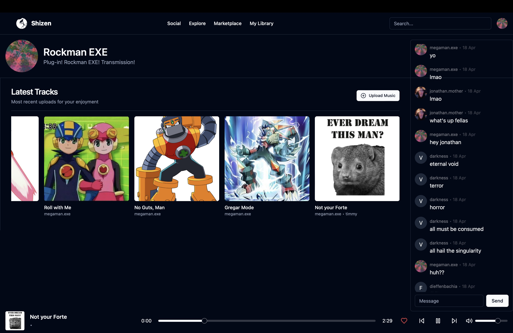

# SHIZEN - Collaborative Music Platform

Think SoundCloud meets Discord. The most overlooked factor in the music industry is the power of networking. **SHIZEN** will provide a platform for artists to connect with other artists, share their music, and collaborate on projects.

## Features
- **User Profiles**: Customize your profile to showcase your music and connect with other artists.
- **Live Chat**: Real-time chat on the homepage for instant community interaction
- **Music Sharing**: Upload and share music with descriptions and cover art
- **Music Player**: Integrated music player with streaming, queueing, and playback controls
- **Trending Page**: Discover popular songs with category filtering
- **Personalized Homepage**: View posts from followed artists
- **Search Functionality**: Find songs, users, artist clubs, or tags
- **Artist Clubs**: Subscription-based exclusive content for fans

## Tech Stack
- Frontend: SvelteKit + TypeScript
- Backend: Pocketbase (Go)

## What is This?
I wanted to learn SvelteKit, and decided to build a full-stack web application to do so. I love making music. This project is a work-in-progress, and I will be updating it as I continue to learn (and have time!!)
